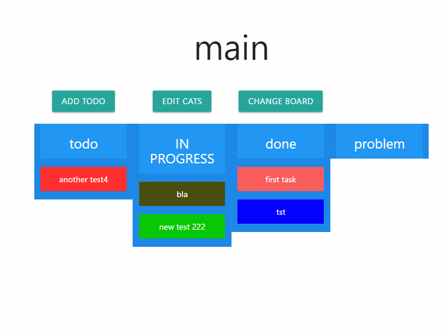
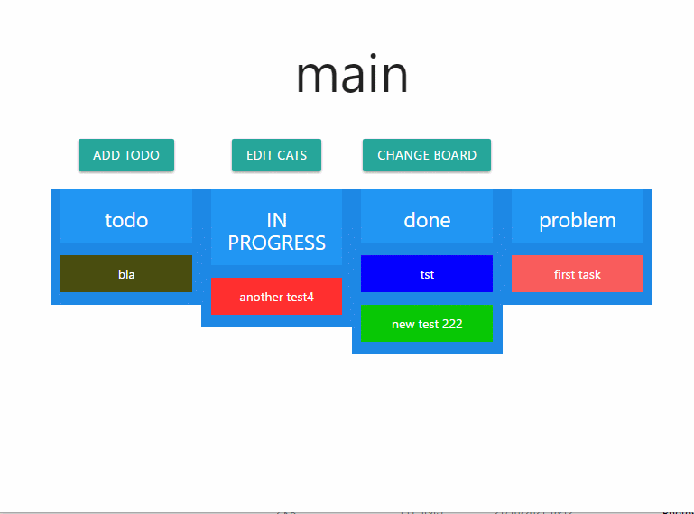
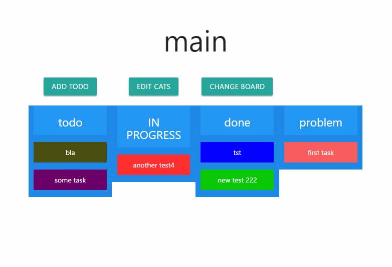
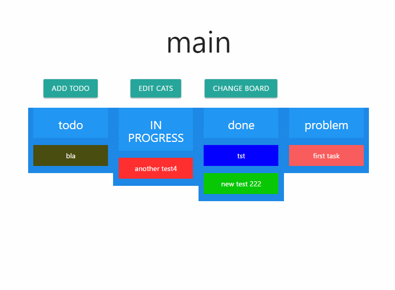
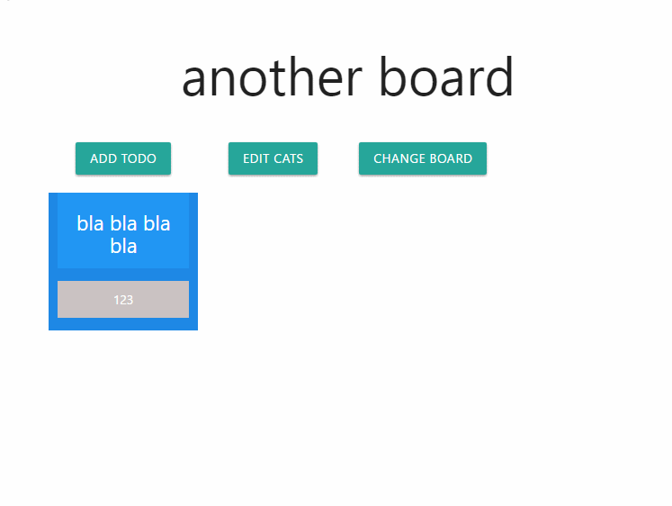

# offline multi project kanban board using phpdesktop 

its a php desktop application that lets you create a static blog.

the purpose: it is a proof of concept for creating a desktop app with php.
and a proof of concept for offline cms that creates a static website, can be used
for many perpuses a blog is the simplest so thats what i did.
the design is very minemal as thats not the focuse of this project.

it uses: 
-phpdesktop as server and browser
-the main programming languge is php
-for the front it uses matrilizecss
-for database it uses sqlite and jason for the static version (the exported blog)
-and it uses my own php framework for rapid dev
-jqury ui drag and drop
-simple js color picker

## features:
*regular kanban boadrd features (drag and drop between boards)
*add edit and remove boards (calld cats)
*add and change project
*double click task to edit/remove it

## how to use?

download the repo, extract all of the zip files, run the exe.

## contact me:

https://ytutor.wordpress.com/contact/

## demo gifs
move tasks:

add task:

edit/ remove task

change kanban board/project:

add category/board

